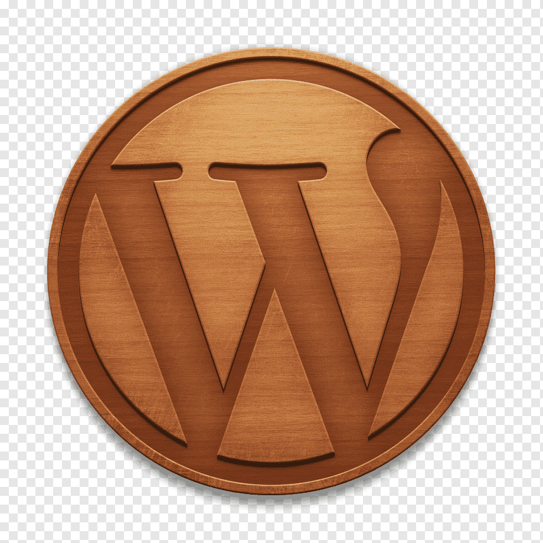

<!-- Improved compatibility of back to top link: See: https://github.com/othneildrew/Best-README-Template/pull/73 -->
<a name="readme-top"></a>
<!--
*** Thanks for checking out the Best-README-Template. If you have a suggestion
*** that would make this better, please fork the repo and create a pull request
*** or simply open an issue with the tag "enhancement".
*** Don't forget to give the project a star!
*** Thanks again! Now go create something AMAZING! :D
-->


<!-- PROJECT SHIELDS -->
<!--
*** I'm using markdown "reference style" links for readability.
*** Reference links are enclosed in brackets [ ] instead of parentheses ( ).
*** See the bottom of this document for the declaration of the reference variables
*** for contributors-url, forks-url, etc. This is an optional, concise syntax you may use.
*** https://www.markdownguide.org/basic-syntax/#reference-style-links
-->
[![Contributors][contributors-shield]][contributors-url]
[![Forks][forks-shield]][forks-url]
[![Stargazers][stars-shield]][stars-url]
[![Issues][issues-shield]][issues-url]
[![MIT License][license-shield]][license-url]
[![LinkedIn][linkedin-shield]][linkedin-url]


<!-- PROJECT LOGO -->
<br />
<div align="center">
  <a href="https://github.com/Alexkazak21/WoodWebAPI">
    
  </a>

<h3 align="center">WoodWebAPI</h3>

  <p align="center">
    project_description
    <br />
    <a href="https://github.com/Alexkazak21/WoodWebAPI"><strong>Explore the docs »</strong></a>
    <br />
    <br />
    <a href="https://github.com/Alexkazak21/WoodWebAPI">View Demo</a>
    ·
    <a href="https://github.com/Alexkazak21/WoodWebAPI/issues">Report Bug</a>
    ·
    <a href="https://github.com/Alexkazak21/WoodWebAPI/issues">Request Feature</a>
  </p>
</div>


<!-- TABLE OF CONTENTS -->
<details>
  <summary>Table of Contents</summary>
  <ol>
    <li>
      <a href="#about-the-project">About The Project</a>
      <ul>
        <li><a href="#built-with">Built With</a></li>
      </ul>
    </li>
    <li>
      <a href="#getting-started">Getting Started</a>
      <ul>
        <li><a href="#prerequisites">Prerequisites</a></li>
        <li><a href="#installation">Installation</a></li>
      </ul>
    </li>
    <li><a href="#contributing">Contributing</a></li>
    <li><a href="#license">License</a></li>
    <li><a href="#contact">Contact</a></li>
  </ol>
</details>


<!-- ABOUT THE PROJECT -->
## About The Project

[![WoodWebAPI][product-screenshot]](https://woodcutters.mydurable.com/)

This project was created for full support of the life cycle of a wood sawing order based on ГОСТ 18288-87.
The main user interaction interface is TelegramBot.

Also it has it's own website [![Wood Cutters][https://woodcutters.mydurable.com/]](https://woodcutters.mydurable.com/)

<p align="right">(<a href="#readme-top">back to top</a>)</p>


### Built With

* [![EfCore][EFcore]]
* [![MSSQL][MSSQL]][MSSQL-url]
* [![Telegram][Telegram]][Telegram-url]
* [![NGROK][NGROK]][NGROK-url]
<!--
* [![Svelte][Svelte.dev]][Svelte-url]
* [![Laravel][Laravel.com]][Laravel-url]
* [![Bootstrap][Bootstrap.com]][Bootstrap-url]
* [![JQuery][JQuery.com]][JQuery-url]
-->
<p align="right">(<a href="#readme-top">back to top</a>)</p>


<!-- GETTING STARTED -->
## Getting Started

To get a local copy up and running follow these simple example steps.

### Prerequisites

This is an example of how to list things you need to use the software and how to install them.
* ngrok
  Create an account at [https://ngrok.com](https://ngrok.com)
  
* MSSQL
	Make sure you have an access to MSSQL server

* Telegram Bot
	Create new Telegram Bot and provide your Telegram Token to `appsettings.json` or `appsettings.Development.json`
### Installation

1. Get a free API Key at [https://ngrok.com](https://ngrok.com)
2. Use the Quike Start guide to start using NGROK using [https://ngrok.com/get-started](https://dashboard.ngrok.com/get-started/setup/windows)
3. Clone the repo
   ```sh
   git clone https://github.com/Alexkazak21/WoodWebAPI.git
   ```
4. Run command from directoty where ngrok.exe is located
   ```sh
   ngrok.exe http 5550
   ```
5. Enter your https URL in `appsettings.json` or `appsettings.Development.json`
   ```json
   "ngrok": {
    "URL": "https://your_https_link"
	}
   ```
6. Fill all empty params in `appsettings.json` or `appsettings.Development.json`
[![config][config-screenshot]]   
7. Apply migrations through Project Manager or CLI
	```sh
   update-database -context applicationdbcontext
   ```
   ```sh
   update-database -context wooddbcontex
   ```
8. Start an app. 
<p align="right">(<a href="#readme-top">back to top</a>)</p>

<!-- CONTRIBUTING -->
## Contributing

Contributions are what make the open source community such an amazing place to learn, inspire, and create. Any contributions you make are **greatly appreciated**.

If you have a suggestion that would make this better, please fork the repo and create a pull request. You can also simply open an issue with the tag "enhancement".
Don't forget to give the project a star! Thanks again!

1. Fork the Project
2. Create your Feature Branch (`git checkout -b feature/AmazingFeature`)
3. Commit your Changes (`git commit -m 'Add some AmazingFeature'`)
4. Push to the Branch (`git push origin feature/AmazingFeature`)
5. Open a Pull Request

<p align="right">(<a href="#readme-top">back to top</a>)</p>


<!-- LICENSE -->
## License

Distributed under the MIT License. See `LICENSE.txt` for more information.

<p align="right">(<a href="#readme-top">back to top</a>)</p>


<!-- CONTACT -->
## Contact

Your Name - [@twitter_handle](https://twitter.com/twitter_handle) - email@email_client.com

Project Link: [https://github.com/Alexkazak21/WoodWebAPI](https://github.com/Alexkazak21/WoodWebAPI)

<p align="right">(<a href="#readme-top">back to top</a>)</p>


<!-- MARKDOWN LINKS & IMAGES -->
<!-- https://www.markdownguide.org/basic-syntax/#reference-style-links -->
[contributors-shield]: https://img.shields.io/github/contributors/Alexkazak21/WoodWebAPI.svg?style=for-the-badge
[contributors-url]: https://github.com/Alexkazak21/WoodWebAPI/graphs/contributors
[forks-shield]: https://img.shields.io/github/forks/Alexkazak21/WoodWebAPI.svg?style=for-the-badge
[forks-url]: https://github.com/Alexkazak21/WoodWebAPI/network/members
[stars-shield]: https://img.shields.io/github/stars/Alexkazak21/WoodWebAPI.svg?style=for-the-badge
[stars-url]: https://github.com/Alexkazak21/WoodWebAPI/stargazers
[issues-shield]: https://img.shields.io/github/issues/Alexkazak21/WoodWebAPI.svg?style=for-the-badge
[issues-url]: https://github.com/Alexkazak21/WoodWebAPI/issues
[license-shield]: https://img.shields.io/github/license/Alexkazak21/WoodWebAPI.svg?style=for-the-badge
[license-url]: https://github.com/Alexkazak21/WoodWebAPI/blob/master/LICENSE.txt
[linkedin-shield]: https://img.shields.io/badge/-LinkedIn-black.svg?style=for-the-badge&logo=linkedin&colorB=555
[linkedin-url]: https://www.linkedin.com/in/%D0%B0%D0%BB%D0%B5%D0%BA%D1%81%D0%B0%D0%BD%D0%B4%D1%80-%D0%BA%D0%B0%D0%B7%D0%B0%D0%BA%D0%B5%D0%B2%D0%B8%D1%87-5a5b88212/
[product-screenshot]: images/screenshot.png
[config-screenshot]: images/config-screenshot.png
[Netcore]: https://img.shields.io/badge/.NetCore-68217A?style=for-the-badge&logo=dotnet
[MSSQL]: https://img.shields.io/badge/MSSQL-CC2927?style=for-the-badge&logo=microsoftsqlserver
[MSSQL-url]: https://www.microsoft.com/ru-ru/sql-server/sql-server-downloads
[Telegram]: https://img.shields.io/badge/Telegram-26A5E4?style=for-the-badge&logo=telegram
[Telegram-url]: https://telegram.org/
[NGROK]: https://img.shields.io/badge/ngrok-1F1E37?style=for-the-badge&logo=ngrok
[NGROK-url]: https://ngrok.com/
[Svelte.dev]: https://img.shields.io/badge/Svelte-4A4A55?style=for-the-badge&logo=svelte&logoColor=FF3E00
[Svelte-url]: https://svelte.dev/
[Laravel.com]: https://img.shields.io/badge/Laravel-FF2D20?style=for-the-badge&logo=laravel&logoColor=white
[Laravel-url]: https://laravel.com
[Bootstrap.com]: https://img.shields.io/badge/Bootstrap-563D7C?style=for-the-badge&logo=bootstrap&logoColor=white
[Bootstrap-url]: https://getbootstrap.com
[JQuery.com]: https://img.shields.io/badge/jQuery-0769AD?style=for-the-badge&logo=jquery&logoColor=white
[JQuery-url]: https://jquery.com 
